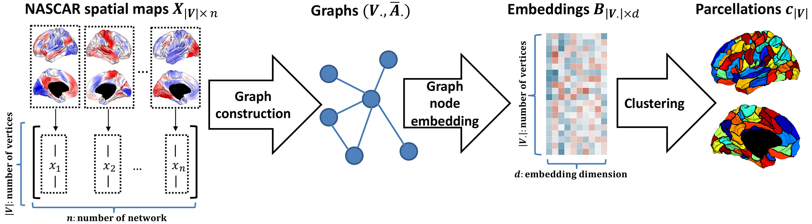

## Untamed: Unconstrained Tensor Decomposition and Graph Node Embedding for Cortical Parcellation


We introduce **Untamed**, a novel framework that integrates unconstrained tensor decomposition using [NASCAR](https://silencer1127.github.io/software/NASCAR/nascar_main) to identify functional networks, with state-of-the-art graph node embedding to generate cortical parcellations. Our method produces near-homogeneous, spatially coherent regions aligned with large-scale functional networks, while avoiding strong assumptions like statistical independence required in ICA. Across multiple datasets, Untamed consistently demonstrates improved or comparable performance in functional connectivity homogeneity and task contrast alignment compared to existing atlases. The pipeline is fully automated, allowing for rapid adaptation to new datasets and the generation of custom parcellations. The atlases derived from the Genomics Superstruct Project (GSP) dataset, along with the code for generating customizable parcel numbers, are publicly available at https://untamed-atlas.github.io, providing a flexible and reproducible resource for the neuroscience community.



#### Citation (New manuscript coming soon, stay tuned!)
```
@article{liu2024graph_bioarxiv,
    title={Graph Learning for Cortical Parcellation from Tensor Decompositions of Resting-State fMRI},
    author={Liu, Yijun and Li, Jian and Wisnowski, Jessica L and Leahy, Richard M},
    journal={bioRxiv},
    pages={2024--01},
    year={2024},
    publisher={Cold Spring Harbor Laboratory}
}
```

